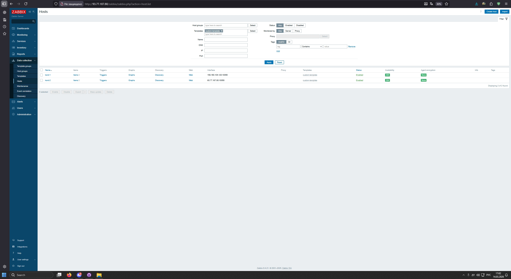
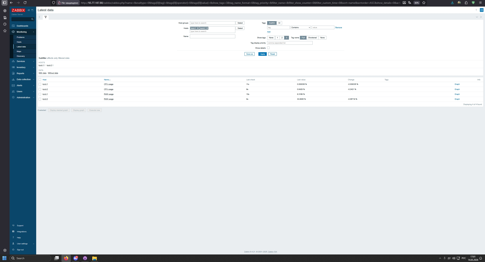
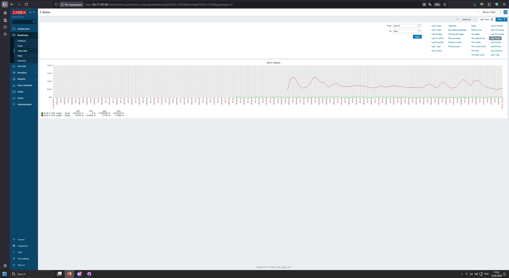
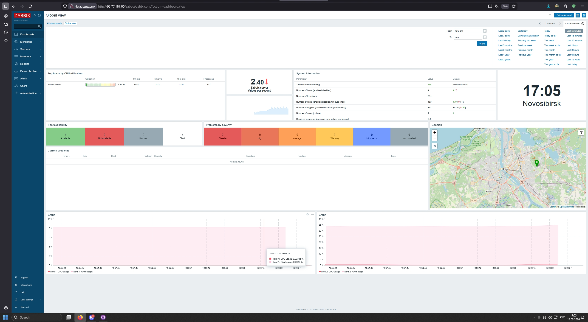

# Домашнее задание к занятию «Система мониторинга Zabbix. Часть 2» - `Шумихин Кирилл`

## Цель работы

Развернуть систему мониторинга **Zabbix**, подключить к ней хосты с установленным **Zabbix Agent**, создать пользовательский шаблон и настроить сбор метрик загрузки CPU и использования RAM.

---

# Архитектура

В работе были развернуты следующие виртуальные машины:

| Хост          | Назначение         |
| ------------- | ------------------ |
| zabbix-server | сервер мониторинга |
| kord-1        | monitored host     |
| kord-2        | monitored host     |

Используемые компоненты:

* Zabbix Server 6.4
* Zabbix Agent
* PostgreSQL
* Debian 11

---

# Развертывание Zabbix Server

Установлены необходимые пакеты:

```
sudo apt install zabbix-server-pgsql zabbix-frontend-php zabbix-apache-conf zabbix-agent postgresql
```

Создана база данных Zabbix:

```
sudo -u postgres createuser --pwprompt zabbix
sudo -u postgres createdb -O zabbix zabbix
```

Импортирована схема базы данных:

```
zcat /usr/share/zabbix-sql-scripts/postgresql/server.sql.gz | psql -U zabbix -d zabbix
```

---

# Настройка подключения к базе данных

Файл конфигурации сервера:

```
/etc/zabbix/zabbix_server.conf
```

Основные параметры подключения:

```
DBHost=localhost
DBPort=5432
DBName=zabbix
DBUser=zabbix
DBPassword=zabbix
```

После настройки сервер был перезапущен:

```
sudo systemctl restart zabbix-server
```

---

# Установка Zabbix Agent

На хостах **kord-1** и **kord-2** установлен агент:

```
sudo apt install zabbix-agent
```

Файл конфигурации агента:

```
/etc/zabbix/zabbix_agentd.conf
```

Основные параметры:

```
Server=<IP Zabbix Server>
ServerActive=<IP Zabbix Server>
```

После настройки агент был перезапущен:

```
sudo systemctl restart zabbix-agent
```

---

# Добавление хостов в Zabbix

В веб-интерфейсе:

```
Data collection → Hosts → Create host
```

Были добавлены хосты:

* kord-1
* kord-2

К ним был применён шаблон:

```
custom-template
```

---

# Создание пользовательского шаблона

Создан шаблон:

```
custom-template
```

Добавлены элементы данных.

## CPU usage

```
system.cpu.util[,user]
```

Тип данных:

```
Numeric (float)
```

Интервал обновления:

```
30s
```

---

## RAM usage

```
vm.memory.size[pused]
```

Тип данных:

```
Numeric (float)
```

Интервал обновления:

```
30s
```

---

# Проверка работы мониторинга

После настройки начали собираться метрики CPU и RAM.

Данные можно увидеть в разделе:

```
Monitoring → Latest data
```

---

# Скриншоты

## Hosts

Список подключенных хостов и статус доступности.



---

## Latest data

Собираемые метрики CPU и RAM.



---

## CPU Graph

График загрузки процессора.



---

## Dashboard

Главная панель мониторинга Zabbix.



---

# Проблемы, возникшие при выполнении

## Проблема подключения к базе данных

В логах Zabbix возникала ошибка:

```
fe_sendauth: no password supplied
```

Причина — отсутствовал пароль подключения к базе данных.

Решение — указать параметр:

```
DBPassword=zabbix
```

в конфигурационном файле сервера.

---

## Ошибка типа данных при сборе RAM usage

Возникала ошибка:

```
Value of type "string" is not suitable for value type "Numeric (unsigned)"
```

Причина — тип данных был указан как `Numeric (unsigned)`, тогда как агент возвращал дробное значение.

Решение — изменить тип данных на:

```
Numeric (float)
```

---

# Итог

В ходе выполнения работы была успешно развернута система мониторинга **Zabbix**.

Результаты:

* сервер мониторинга развернут и работает
* агенты успешно подключены
* хосты доступны
* собираются метрики CPU и RAM
* данные отображаются на графиках и Dashboard
* мониторинг функционирует корректно

---

# Репозиторий

```
https://github.com/thekord54-oss/hw-02.md
```
